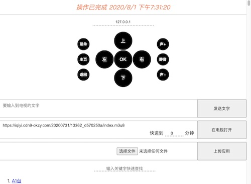

# 安卓电视局域网遥控器   

## 功能  

1.  支持向上、向下、向左、向右、确认、首页、返回、菜单、音量+、音量-、静音按键功能;  
1.  支持远程输入文字功能;    
1.  控制端无需安装app,使用微信扫码即可使用;   
1.  支持粘贴视频url在电视中播放功能;   
1.  支持上传应用到电视中安装;   
1.  支持iptv电视列表点播;   

## 使用方法   
1.  下载最新版本;    
1.  安装至安卓电视中;   
1.  设置本应用为电视默认输入法;  
1.  打开本应用;  
1.  微信扫码后使用;  
1.  client端目前使用七牛oss,建议复制代码自行搭建client;  

## 测试环境   
1.  avd android tv api 25  
1.  坚果投影仪m6  

## 组件  
1. exoPlayer  
1. vueJs   

  
## 截屏      

   

## 计划  

1.  升级提醒功能;  
1.  手机端html代码apk内置;  
1.  优化按键事件响应消息;  
1.  修复小米android 6的兼容问题;  

## 更新历史   

### 2020.9.11  
1.  删除内置的电视播放列表; 
1.  优化缓存更新机制;  
1.  删除无用文件;  
