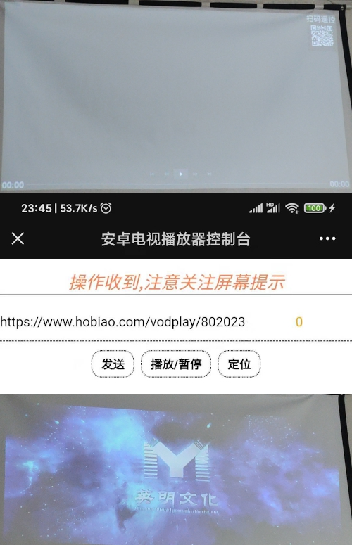

# 安卓视频播放器   

## 功能  

1.  在tv中播放视频链接    
1.  在tv中从含视频链接的页面中捕捉视频链接       
1.  手机扫码控制、发送视频链接或含视频的页面链接     

## 使用方法   
1.  [从releases下载最新版本](./releases);    
1.  安装至安卓电视;   
1.  运行本应用;  
1.  微信扫码后使用;  

## 正常使用的环境   
1.  avd android api 29  
1.  坚果投影仪m6  

## 可能无法正常使用的环境  

1.  avd android 4.1: 缺失视频解码器; ssl根证书异常;  

## 组件  
1. exoPlayer  
1. vueJs   

  
## 效果图        

   

## 计划  

1.  升级提醒功能;  

## 更新历史   

### 2020.9.11  
1.  删除内置的电视播放列表; 
1.  优化缓存更新机制;  
1.  删除无用文件;  

### 2021.3.6  
1.  定位的ime+播放器简化为只做播放器;  
1.  初步实现播放视频链接、自动提取页面中m3u8视频链接、扫码控制;  

